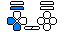
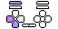

# inputdisplay-skins

全て、[むいにゃん(ふんぐるむい)](https://twitter.com/mui_nyan)氏作の[padlight用スキンps2pad](http://web.archive.org/web/20190304130553/http://www.geocities.jp/hungurumui/padskin.html)の移植(＆色違い)版。

<dl>
  <dt>ps2pad</dt>
  <dd>
  <dt>ps2pad-black</dt>
  <dd>
  <dt>f310</dt>
  <dd>
  <dt>f310-black</dt>
  <dd>
</dl>

## [Gamepad Viewer](http://gamepadviewer.com/)
- [ps2pad](gamepadviewer/ps2pad)
- [ps2pad-black](gamepadviewer/ps2pad-black)
- [f310](gamepadviewer/f310)
- [f310-black](gamepadviewer/f310-black)

### Premade Link (左スティックを十字キーへアサイン済)
- [ps2pad](https://gamepadviewer.com/?p=1&map=%7B%22mapping%22%3A%5B%7B%22targetType%22%3A%22buttons%22%2C%22target%22%3A%2212%22%2C%22disabled%22%3Afalse%2C%22choiceOperand%22%3A%22-%22%2C%22choiceType%22%3A%22axes%22%2C%22choice%22%3A%221%22%7D%2C%7B%22targetType%22%3A%22buttons%22%2C%22target%22%3A%2213%22%2C%22disabled%22%3Afalse%2C%22choiceOperand%22%3A%22%2B%22%2C%22choiceType%22%3A%22axes%22%2C%22choice%22%3A%221%22%7D%2C%7B%22targetType%22%3A%22buttons%22%2C%22target%22%3A%2214%22%2C%22disabled%22%3Afalse%2C%22choiceOperand%22%3A%22-%22%2C%22choiceType%22%3A%22axes%22%2C%22choice%22%3A%220%22%7D%2C%7B%22targetType%22%3A%22buttons%22%2C%22target%22%3A%2215%22%2C%22disabled%22%3Afalse%2C%22choiceOperand%22%3A%22%2B%22%2C%22choiceType%22%3A%22axes%22%2C%22choice%22%3A%220%22%7D%5D%7D&css=https://pingval.github.io/inputdisplay-skins/gamepadviewer/ps2pad/ps2pad.css)
  - [背景透過版](https://gamepadviewer.com/?p=1&map=%7B%22mapping%22%3A%5B%7B%22targetType%22%3A%22buttons%22%2C%22target%22%3A%2212%22%2C%22disabled%22%3Afalse%2C%22choiceOperand%22%3A%22-%22%2C%22choiceType%22%3A%22axes%22%2C%22choice%22%3A%221%22%7D%2C%7B%22targetType%22%3A%22buttons%22%2C%22target%22%3A%2213%22%2C%22disabled%22%3Afalse%2C%22choiceOperand%22%3A%22%2B%22%2C%22choiceType%22%3A%22axes%22%2C%22choice%22%3A%221%22%7D%2C%7B%22targetType%22%3A%22buttons%22%2C%22target%22%3A%2214%22%2C%22disabled%22%3Afalse%2C%22choiceOperand%22%3A%22-%22%2C%22choiceType%22%3A%22axes%22%2C%22choice%22%3A%220%22%7D%2C%7B%22targetType%22%3A%22buttons%22%2C%22target%22%3A%2215%22%2C%22disabled%22%3Afalse%2C%22choiceOperand%22%3A%22%2B%22%2C%22choiceType%22%3A%22axes%22%2C%22choice%22%3A%220%22%7D%5D%7D&css=https://pingval.github.io/inputdisplay-skins/gamepadviewer/ps2pad/ps2pad-transparent.css)
- [ps2pad-black](https://gamepadviewer.com/?p=1&map=%7B%22mapping%22%3A%5B%7B%22targetType%22%3A%22buttons%22%2C%22target%22%3A%2212%22%2C%22disabled%22%3Afalse%2C%22choiceOperand%22%3A%22-%22%2C%22choiceType%22%3A%22axes%22%2C%22choice%22%3A%221%22%7D%2C%7B%22targetType%22%3A%22buttons%22%2C%22target%22%3A%2213%22%2C%22disabled%22%3Afalse%2C%22choiceOperand%22%3A%22%2B%22%2C%22choiceType%22%3A%22axes%22%2C%22choice%22%3A%221%22%7D%2C%7B%22targetType%22%3A%22buttons%22%2C%22target%22%3A%2214%22%2C%22disabled%22%3Afalse%2C%22choiceOperand%22%3A%22-%22%2C%22choiceType%22%3A%22axes%22%2C%22choice%22%3A%220%22%7D%2C%7B%22targetType%22%3A%22buttons%22%2C%22target%22%3A%2215%22%2C%22disabled%22%3Afalse%2C%22choiceOperand%22%3A%22%2B%22%2C%22choiceType%22%3A%22axes%22%2C%22choice%22%3A%220%22%7D%5D%7D&css=https://pingval.github.io/inputdisplay-skins/gamepadviewer/ps2pad-black/ps2pad-black.css)
  - [背景透過版](https://gamepadviewer.com/?p=1&map=%7B%22mapping%22%3A%5B%7B%22targetType%22%3A%22buttons%22%2C%22target%22%3A%2212%22%2C%22disabled%22%3Afalse%2C%22choiceOperand%22%3A%22-%22%2C%22choiceType%22%3A%22axes%22%2C%22choice%22%3A%221%22%7D%2C%7B%22targetType%22%3A%22buttons%22%2C%22target%22%3A%2213%22%2C%22disabled%22%3Afalse%2C%22choiceOperand%22%3A%22%2B%22%2C%22choiceType%22%3A%22axes%22%2C%22choice%22%3A%221%22%7D%2C%7B%22targetType%22%3A%22buttons%22%2C%22target%22%3A%2214%22%2C%22disabled%22%3Afalse%2C%22choiceOperand%22%3A%22-%22%2C%22choiceType%22%3A%22axes%22%2C%22choice%22%3A%220%22%7D%2C%7B%22targetType%22%3A%22buttons%22%2C%22target%22%3A%2215%22%2C%22disabled%22%3Afalse%2C%22choiceOperand%22%3A%22%2B%22%2C%22choiceType%22%3A%22axes%22%2C%22choice%22%3A%220%22%7D%5D%7D&css=https://pingval.github.io/inputdisplay-skins/gamepadviewer/ps2pad-black/ps2pad-black-transparent.css)
- [f310](https://gamepadviewer.com/?p=1&map=%7B%22mapping%22%3A%5B%7B%22targetType%22%3A%22buttons%22%2C%22target%22%3A%2212%22%2C%22disabled%22%3Afalse%2C%22choiceOperand%22%3A%22-%22%2C%22choiceType%22%3A%22axes%22%2C%22choice%22%3A%221%22%7D%2C%7B%22targetType%22%3A%22buttons%22%2C%22target%22%3A%2213%22%2C%22disabled%22%3Afalse%2C%22choiceOperand%22%3A%22%2B%22%2C%22choiceType%22%3A%22axes%22%2C%22choice%22%3A%221%22%7D%2C%7B%22targetType%22%3A%22buttons%22%2C%22target%22%3A%2214%22%2C%22disabled%22%3Afalse%2C%22choiceOperand%22%3A%22-%22%2C%22choiceType%22%3A%22axes%22%2C%22choice%22%3A%220%22%7D%2C%7B%22targetType%22%3A%22buttons%22%2C%22target%22%3A%2215%22%2C%22disabled%22%3Afalse%2C%22choiceOperand%22%3A%22%2B%22%2C%22choiceType%22%3A%22axes%22%2C%22choice%22%3A%220%22%7D%5D%7D&css=https://pingval.github.io/inputdisplay-skins/gamepadviewer/f310/f310.css)
  - [背景透過版](https://gamepadviewer.com/?p=1&map=%7B%22mapping%22%3A%5B%7B%22targetType%22%3A%22buttons%22%2C%22target%22%3A%2212%22%2C%22disabled%22%3Afalse%2C%22choiceOperand%22%3A%22-%22%2C%22choiceType%22%3A%22axes%22%2C%22choice%22%3A%221%22%7D%2C%7B%22targetType%22%3A%22buttons%22%2C%22target%22%3A%2213%22%2C%22disabled%22%3Afalse%2C%22choiceOperand%22%3A%22%2B%22%2C%22choiceType%22%3A%22axes%22%2C%22choice%22%3A%221%22%7D%2C%7B%22targetType%22%3A%22buttons%22%2C%22target%22%3A%2214%22%2C%22disabled%22%3Afalse%2C%22choiceOperand%22%3A%22-%22%2C%22choiceType%22%3A%22axes%22%2C%22choice%22%3A%220%22%7D%2C%7B%22targetType%22%3A%22buttons%22%2C%22target%22%3A%2215%22%2C%22disabled%22%3Afalse%2C%22choiceOperand%22%3A%22%2B%22%2C%22choiceType%22%3A%22axes%22%2C%22choice%22%3A%220%22%7D%5D%7D&css=https://pingval.github.io/inputdisplay-skins/gamepadviewer/f310/f310-transparent.css)
- [f310-black](https://gamepadviewer.com/?p=1&map=%7B%22mapping%22%3A%5B%7B%22targetType%22%3A%22buttons%22%2C%22target%22%3A%2212%22%2C%22disabled%22%3Afalse%2C%22choiceOperand%22%3A%22-%22%2C%22choiceType%22%3A%22axes%22%2C%22choice%22%3A%221%22%7D%2C%7B%22targetType%22%3A%22buttons%22%2C%22target%22%3A%2213%22%2C%22disabled%22%3Afalse%2C%22choiceOperand%22%3A%22%2B%22%2C%22choiceType%22%3A%22axes%22%2C%22choice%22%3A%221%22%7D%2C%7B%22targetType%22%3A%22buttons%22%2C%22target%22%3A%2214%22%2C%22disabled%22%3Afalse%2C%22choiceOperand%22%3A%22-%22%2C%22choiceType%22%3A%22axes%22%2C%22choice%22%3A%220%22%7D%2C%7B%22targetType%22%3A%22buttons%22%2C%22target%22%3A%2215%22%2C%22disabled%22%3Afalse%2C%22choiceOperand%22%3A%22%2B%22%2C%22choiceType%22%3A%22axes%22%2C%22choice%22%3A%220%22%7D%5D%7D&css=https://pingval.github.io/inputdisplay-skins/gamepadviewer/f310-black/f310-black.css)
  - [背景透過版](https://gamepadviewer.com/?p=1&map=%7B%22mapping%22%3A%5B%7B%22targetType%22%3A%22buttons%22%2C%22target%22%3A%2212%22%2C%22disabled%22%3Afalse%2C%22choiceOperand%22%3A%22-%22%2C%22choiceType%22%3A%22axes%22%2C%22choice%22%3A%221%22%7D%2C%7B%22targetType%22%3A%22buttons%22%2C%22target%22%3A%2213%22%2C%22disabled%22%3Afalse%2C%22choiceOperand%22%3A%22%2B%22%2C%22choiceType%22%3A%22axes%22%2C%22choice%22%3A%221%22%7D%2C%7B%22targetType%22%3A%22buttons%22%2C%22target%22%3A%2214%22%2C%22disabled%22%3Afalse%2C%22choiceOperand%22%3A%22-%22%2C%22choiceType%22%3A%22axes%22%2C%22choice%22%3A%220%22%7D%2C%7B%22targetType%22%3A%22buttons%22%2C%22target%22%3A%2215%22%2C%22disabled%22%3Afalse%2C%22choiceOperand%22%3A%22%2B%22%2C%22choiceType%22%3A%22axes%22%2C%22choice%22%3A%220%22%7D%5D%7D&css=https://pingval.github.io/inputdisplay-skins/gamepadviewer/f310-black/f310-black-transparent.css)

## [RetroSpy](https://retro-spy.com/)
- [playstation-digital-64x32-light](RetroSpy/playstation-digital-64x32-light)
- [playstation-digital-64x32-dark](RetroSpy/playstation-digital-64x32-dark)

## [padlight](http://chechepon.tripod.com/test/padlight.html)
- [ps2pad-black](padlight/ps2pad-black)
- [f310](padlight/f310)
- [f310-black](padlight/f310-black)
